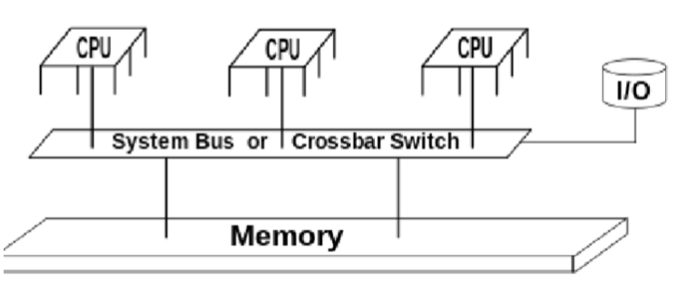
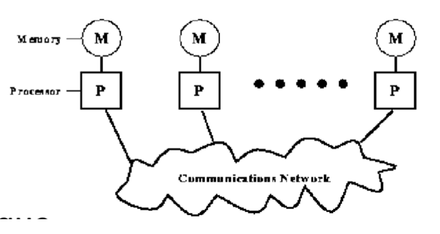
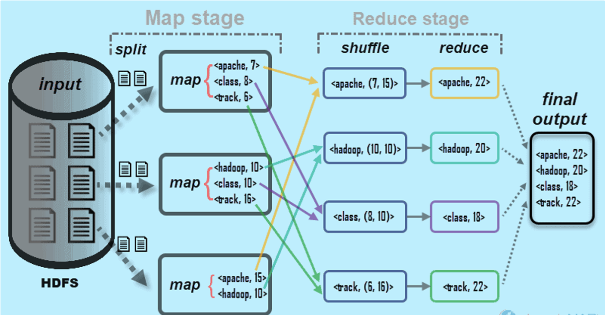
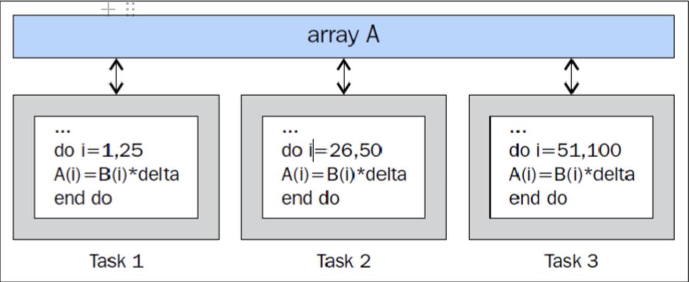

# Programación Concurrente

## Concurrencia

<aside>
🗒️ La concurrencia se refiere a la idea de **ejecutar varias tareas (independientes al mismo tiempo (simultanea)** pudiendo involucrar el i**ntercalar los tiempos de ejecución entre tareas**

</aside>

Esto se puede lograr de manera compartida en un solo núcleo de CPU (lo que implica 'Multitarea') o en paralelo en el caso de múltiples núcleos de CPU (procesamiento paralelo).

Se asocia principalmente a técnicas de programación y no a capacidades computacionales (hardware) como el paralelismo. Simula una simultanead.

- El programa concurrente es un programa que ofrece más de una ruta de ejecución que se ejecuta en paralelo o simplemente un programa que implementa la concurrencia. Estas rutas de ejecución se gestionan mediante subprocesos que se ejecutan simultáneamente y trabajan juntos para realizar alguna tarea

*No debe confundirse con el paralelismo, la programación concurrente o concurrente es cuando se ejecutan múltiples secuencias de operaciones en períodos de tiempo superpuestos.

## Paralelismo

<aside>
🗒️ Ejecutar multiples actividades independientes de forma simultanea, limitado por las capacidades computacionales, numero de procesadores, o recursos computacionales

</aside>

El paralelismo depende de el hardware y el procesador

- Concurrencia en un solo nodo (una sola estructura) - Se comparte la memoria con un solo nodo
- Async APIs son un ejemplo de programación concurrente

## Infraestructura de un sistema concurrente

- Multiples procesadores → Permiten realizar muchas tareas simultáneamente
- Recursos compartido →  Memoria …

<aside>
📜 En una computadora, tenemos procesadores ( ej. C1, C2), tenemos la memoria (recursos compartidos), y esto esta manejado por un OS (sistema operativo). Doble core nos da la capacidad de paralelismo. Para poder utilizar los procesadores con memoria compartida, necesitamos el sistema operativo. Cualquier sistema que desarrolle, tiene que pasar por el sistema operativo. Cuando desarrollo una app concurrente, no se accede directamente a los procesadores. Es el sistema operativo que a través del schedule accede al procesador - Define cuando utilizar un procesador. Sí le podemos decir por ejemplo, “necesito dos procesadores” y el OS decide que procesador.

</aside>

## Modelos de programación

### Modelo Shared Memory

- La memoria es compartida entre varios procesadores
- Nos deja usar el mismo recurso n veces. Por ejemplo (que por cada alumno la universidad ponga un sitio en la biblioteca, ponerle a cada uno una memoria es equivalente) Problema → Se satura
- Problemas:
    - Race condition (problema) → Condición de competencia. Difícil de eliminar
    - Data race → Mas facil de eliminar
- Ventaja:
    - Todo esta a la mano

### Modelo Message Passing

- Los procesadores tiene uso exclusivo a su memoria
- Se utiliza para varios nodos (computadoras diferentes) - se comunican a través  de un sistema de comunicación. Lo que se hace en este caso, es la mensajería asíncrona.
- Paralelismo declarado explícitamente. Se requiere analizar, diseñar y/o seleccionar el algoritmo
- Alta flexibilidad  - Difícil de diseñar
- Se adapta a la super computación o en sistemas que cuentan con un cluster de computadores

### Modelo Data Parallel

- Modelo muy especifico, basicamente para hacer calculos numericos
- Se usa bastante para lo que es procesamiento de imagenes y calculos matematicos (imagenes = matrices).
- Se puede hacer un algoritmo que toma la data, y particiona (parte) la data en grupos, y cada procesador se encarga de una parte en especifico
- Un patron que se utiliza en esto se llama Mat Reduce
    - MapReduce es un paradigma de programación que permite una escalabilidad masiva en cientos o miles de servidores en un clúster de Hadoop.
    - Por ejemplo una matriz (imagen) se puede descomponer en partes, se procesa por separado y luego se reduce al resultado.

- Operan sobre una misma estructura de datos pero en diferente porción de datos.
- Se aplica tanto a memoria compartida como para memoria distribuida.
- Quien programe o diseñe el algoritmo debe especificar la distribución y alineamiento de la data
- La generaciones de procesadores del tipo GPU operan cómodamente con este tipo de modelo.
  

## Procesos, hilos

### Procesor

- Cuando hablamos del procesador, estamos hablando de la computadora. Y tiene varios procesos/core.
- Los core tienen HIPERTHREADING. Un procesador tiene la capacidad para procesar una operación a la vez, pero en hardware han configurado para que pueda trabajar con varios hilos.
- Si una computadora tiene cuatro procesadores, realmente por hardware tiene la capacidad de que cada core trabaja con cuatro hilos físicos. Osea, es como si tuviéramos 16 cores.
- Como manejan los sistemas operativos los procesadores: Cada vez que se ejecuta un programa, el sistema operativo:
    1. Construye un proceso
    - Un proceso esta conformado por:
        - Referencia al ALU (esquema logico)
        - ALU - Definición

          En computación, la **unidad aritmética lógica** o **unidad aritmético-lógica**, también conocida como **ALU** (siglas en inglés de *arithmetic logic unit*), es un circuito digital que realiza operaciones aritméticas (suma, resta) y operaciones lógicas (SI, Y, O, NO) entre los valores de los argumentos (uno o dos)

          Por mucho, los circuitos electrónicos más complejos son los que están construidos dentro de los chips de microprocesadores modernos. Por lo tanto, estos procesadores tienen dentro de ellos un ALU muy complejo y potente. De hecho, un microprocesador moderno (y los mainframes) puede tener múltiples núcleos, cada núcleo con múltiples unidades de ejecución, cada una de ellas con múltiples ALU.

          Muchos otros circuitos pueden contener en el interior una unidad aritmético lógica: unidades de procesamiento gráfico como las que están en las GPU modernas, FPU como el viejo co procesador matemático 80387, y procesadores digitales de señales como los que se encuentran en tarjetas de sonido, lectoras de CD y los televisores de alta definición. Todos estos tienen en su interior varias ALU potentes y complejas.

        - Inicialmente → un solo hilo
        - Memoria - no accesible por otro proceso -  no compartida - variada (depende de cuanta hay)
        - Hilos - Cada hilo tiene un stack - Accede a la memoria y al procesador . Se crean varios hilos en el proceso
- Para cosas pequeñas es mejor crear un proceso y varios hilos con memoria compartida
- Doble + proceso → RPC (Remote process communication) (TCP/IP -  UDP/IP - HTTP)  NO LO VAMOS A VER

_08.23.12.png)

### `std::thread`

Hasta ahora:

- Cada vez que hacemos un programa en C++ se ejecuta un hilo
- A ese hilo, se le asigna un proceso (la función main)

La idea de un hilo es hacer lo siguiente…

1. Dentro del proceso main, se crea otro hilo.
2. Se crea alguna función a ese hilo. - Asignar funcion-  Una vez ejecutado, el hilo regresa al main
3. Unir el hilo
4. Detach the thread

## Ejercicio - Clase 3

Tratar la sumatoria de un vector en hilos

1. Partir el contenedor en un tamaño
2. Asignar as cada hilo el rango correspondiente
3.

PC2 23/ Martes de la semana 12

1. Segunda parte de la librería standard 6
- Templates
- STL  - Algoritmos
1. Otro prob de librería standard (complejidad algorítmica )  6
2. Pregunta teórica (Caso especifico, tenemos que describir el Patrón que recomienda) 5
3. Hilos 6